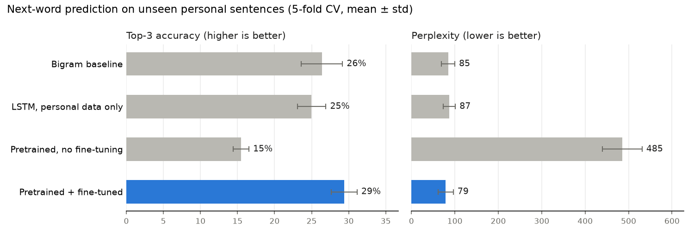

# NextWord Keyboard (LSTM)

A personal next-word prediction keyboard. A PyTorch LSTM is **pretrained on general English** (WikiText-2, 1.9M words), then **fine-tuned on my own writing** (CV, projects and an "about me"). It's served through Flask to an iPhone-style keyboard with a suggestion bar, grey inline completion, and a chat where the LSTM finishes your sentences.



## Results

All models are evaluated with **5-fold cross-validation over my personal sentences**. In every fold, each model is scored on exactly the same held-out words:

| Model | Top-3 accuracy | Top-1 accuracy | Perplexity ↓ | Knows the word |
|---|---|---|---|---|
| **Pretrained + fine-tuned** | **29.4% ± 1.7** | **18.6% ± 2.4** | **78.9 ± 17.4** | **90.5%** |
| Bigram baseline | 26.4% ± 2.8 | 16.2% ± 1.9 | 84.6 ± 15.3 | 72.7% |
| LSTM, personal data only | 25.0% ± 1.9 | 16.1% ± 1.7 | 87.2 ± 13.8 | 72.7% |
| Pretrained, no fine-tuning | 15.5% ± 1.1 | 7.5% ± 0.4 | 485.3 ± 45.7 | 79.3% |

- **Top-k accuracy** is measured over *every* test word. A word a model can't produce counts as a miss, so all models share the same denominator.
- **Perplexity** is measured over the words every model knows, so the numbers are directly comparable.
- **Knows the word** is the share of test words in the model's vocabulary.

**What this shows**
- **Transfer learning works.** Pretraining plus fine-tuning is best on every metric. On top-3 it beats both baselines in 4 of 5 folds and ties the bigram in the other.
- **The gain comes from vocabulary and language knowledge.** Trained on my ~100 sentences alone, an LSTM can't beat a bigram: about 27% of test words never appear in training. The pretrained model already knows 90% of them, and fine-tuning teaches it my phrasing.
- **Either stage alone is not enough.** The pretrained model by itself writes like Wikipedia: "i love to" → *be, the, have*. After fine-tuning: "I love to" → *visit, play, hike*.


The training curves show overfitting that early stopping catches: validation loss bottoms out while training loss keeps falling. The two panels' loss values are not directly comparable. The personal-only model's loss skips the ~27% of words outside its small vocabulary, while the fine-tuned model is scored on nearly all of them.

### Sample suggestions and replies (shipped model)

| You type | Suggestions | Chat reply (LSTM continues) |
|---|---|---|
| `I love to` | visit · play · code | …visit new places in the mountains walk through… |
| `Snooker is a game of` | patience · my · a | …patience focus and planning. |
| `I am currently learning` | natural · my · identified | …natural language processing and transformers. |
| `I built a diabetes risk` | predictor · against · for | …predictor for women using python pandas numpy matplotlib… |

### Two goals, two training lengths

Cross-validation answers *"how well does it predict sentences it has never seen?"*. That peaks after ~18 fine-tuning epochs, and those epochs produced the table above. But the shipped keyboard should know **my own** sentences well. At 18 epochs it predicts only 57% of my next words, and its chat replies kept looping on frequent phrases ("a new machine learning…" in 5 of 10 replies). At **70 epochs** it predicts 92% of them and replies stay coherent, so the app model is fine-tuned for 70 epochs (`FINAL_EPOCHS` in `train.py`).

| Fine-tuning epochs | Next word right on my own text | Most repeated phrase across 10 replies |
|---|---|---|
| 18 (best for unseen text) | 57% | "new machine learning" ×5 |
| 40 | 88% | "and i am" ×2 |
| **70 (shipped)** | **92%** | none |

## How it works

**Stage 1: pretraining** (`pretrain.py`)
- **Data**: WikiText-2 (raw), 1.87M training tokens, downloaded automatically. Vocabulary is the 12,000 most frequent words.
- **Model**: Embedding(256) → LSTM(256) → Linear, with **tied input/output embeddings** (Press & Wolf, 2017) and dropout 0.3.
- **Training**: language-model training on the token stream. Batch 64, truncated backprop through time over 35 steps, Adam with a step-decayed learning rate, 4 epochs. WikiText validation perplexity went 425 → 351 → 321 → **305**.

**Stage 2: fine-tuning** (`train.py`)
- **Vocabulary**: the pretrained vocabulary is extended with my words. Known words keep their trained vectors, and new ones start random.
- **Examples**: every prefix of every sentence becomes one (context → next word) example. Contexts are left-padded to 30 tokens, and the LSTM **skips padding entirely** using packed sequences.
- **Training**: learning rate 1e-3 (lower than pretraining, so knowledge is adapted rather than overwritten), dropout 0.5, early stopping on a validation slice.
- **Shipped model**: fine-tuned on all sentences for 70 epochs. See *Two goals, two training lengths* above.

**Data handling**
- Contact details and URLs are removed from the personal corpus.
- In each fold, the vocabulary comes from training sentences only.
- The bigram baseline is interpolated with a unigram distribution (λ = 0.7).

## Project structure

```
LSTM/
├── streamlit_app.py        # Streamlit app (used for deployment)
├── app.py                  # Flask server: page, /predict, /continue
├── pretrain.py             # stage 1: WikiText-2 language model
├── train.py                # stage 2: fine-tuning + 4-way cross-validation
├── nextword/
│   ├── model.py            # tokenizer, LSTM, vocab expansion, Predictor
│   └── wikitext.py         # WikiText-2 download + preprocessing
├── data/corpus.txt         # personal training text
├── artifacts/
│   ├── pretrained_lstm.pt  # stage 1 model
│   └── lstm_next_word.pt   # shipped model
├── reports/                # metrics.json, pretrain_metrics.json, charts
├── frontend/               # iPhone keyboard UI (html/css/js), shared by both apps
└── notebooks/LSTM.ipynb    # original exploration notebook
```

## Setup and usage

```powershell
python -m venv venv
.\venv\Scripts\activate
pip install -r requirements.txt

python pretrain.py   # optional, ~35 min on CPU: the pretrained model is already in artifacts/
python train.py      # ~12 min: cross-validation + final fine-tuning
streamlit run streamlit_app.py   # Streamlit version: http://localhost:8501
python app.py                    # or the Flask version: http://127.0.0.1:5000
```

In the UI:
- Tap a suggestion, or press **Tab**, to accept it. Grey inline text shows the top prediction.
- Press **Enter** to send. The LSTM replies by continuing your sentence.

## Limitations and next steps

- **More personal text** is still the biggest lever, since only ~100 sentences are used for fine-tuning.
- **Greedy generation** in chat replies tends to drift and repeat. Beam search or nucleus sampling would help.
- **Subword tokenization** (BPE) would let the model handle words it has never seen.
- **A small Transformer** pretrained the same way would be a natural comparison.
