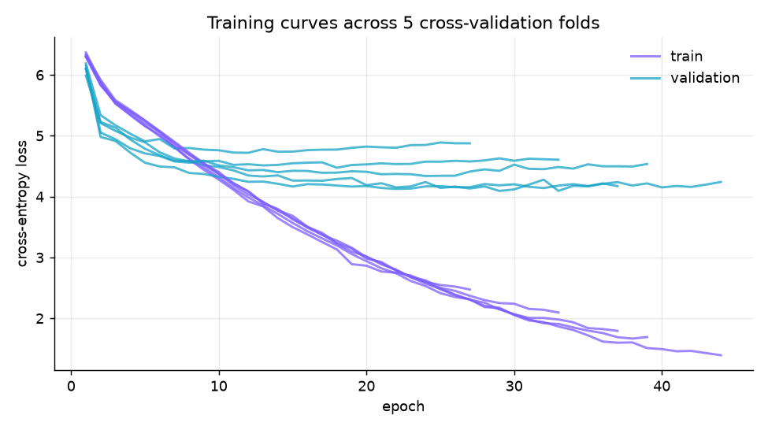

# NextWord Keyboard (LSTM)

A personal next-word prediction keyboard. A PyTorch LSTM language model is trained on my own writing (CV, projects and an "about me"), and served through Flask to an iPhone-style keyboard that suggests the next word and completes the word you are typing.



## Results

Evaluated with **5-fold cross-validation over sentences**: every fold is scored on sentences the model never saw, against an interpolated **bigram baseline** trained on the same data.

| Model | Perplexity ↓ | Top-1 accuracy | Top-3 accuracy |
|---|---|---|---|
| LSTM | **99.9 ± 18.9** | 20.7% ± 2.5% | **36.3% ± 2.6%** |
| Bigram baseline | 106.4 ± 21.7 | **22.2% ± 1.9%** | 36.2% ± 2.7% |

**What this shows:** on unseen sentences the LSTM roughly matches a bigram model. It has slightly lower perplexity, and the accuracies are equal within noise. The bottleneck is data, not architecture: the corpus has only ~100 sentences, and **~27% of test words never appear in training**, so no model can predict them. The training curves show the same thing: validation loss bottoms out around epoch 12–29 while training loss keeps falling, which is overfitting that early stopping catches.

Sample suggestions from the shipped model:

| You type | Suggestions |
|---|---|
| `I love to` | code · hike · visit |
| `I love to play` | football · new · table |
| `I love to visit the` | mountains · data · monthly |
| `Snooker is a game of` | patience · coding · focus |
| `Built a diabetes risk` | predictor · risk · for |

## How it works

- **Data**: `data/corpus.txt`, split into sentences. Contact details and URLs are removed.
- **Tokenizing**: lowercase NLTK word tokens. `<pad>` (0) and `<unk>` (1) are separate indices, and the embedding uses `padding_idx` so padding never carries meaning.
- **Training examples**: every prefix of every sentence gives one example, with the context left-padded to 30 tokens. The empty prefix is included, so the model also learns how sentences start.
- **Model**: Embedding(128) → LSTM(128 hidden, 1 layer) → dropout 0.5 → Linear(vocab). Adam with weight decay 1e-4, gradient clipping, and learning rate reduced on plateau.
- **Model choice**: a small validation sweep. Bigger 2-layer models (256 hidden) overfit within ~6 epochs on this little data.
- **Evaluation**: in each fold, the vocabulary is built from training sentences only. Early stopping uses a 10% validation slice. Perplexity and top-k accuracy are computed on the held-out fold, excluding out-of-vocabulary targets.
- **Shipped model**: retrained on the full corpus for 60 epochs. It is a personal keyboard, so the deployed model is meant to learn all of my writing, the way a phone keyboard adapts to its user.

## Project structure

```
LSTM/
├── app.py                  # Flask server (UI + /predict API)
├── train.py                # cross-validation, baseline, final training
├── nextword/
│   └── model.py            # tokenizer, LSTM, Predictor
├── data/
│   └── corpus.txt          # training text
├── artifacts/
│   └── lstm_next_word.pt   # trained model + vocab
├── reports/
│   ├── metrics.json        # per-fold and averaged metrics
│   └── loss_curve.png
├── templates/index.html    # keyboard page
├── static/                 # css + js
├── notebooks/
│   └── LSTM.ipynb          # original exploration notebook
└── requirements.txt
```

## Setup

```powershell
python -m venv venv
.\venv\Scripts\activate
pip install -r requirements.txt
python -m ipykernel install --user --name lstm-venv --display-name "Python (LSTM venv)"
```

## Usage

```powershell
python train.py   # cross-validate, then train the final model (~2 min on CPU)
python app.py     # open http://127.0.0.1:5000
```

In the UI, tap a suggestion (or press **Tab**) to accept it, and press **Enter** to send.

## Next steps

- **More text.** This is the biggest lever. More of my own writing would cut the 27% out-of-vocabulary rate.
- Pretrain on a general English corpus, then fine-tune on personal text.
- Subword tokenization (BPE), so unseen words can still be built from known pieces.
- Compare against a small Transformer.
